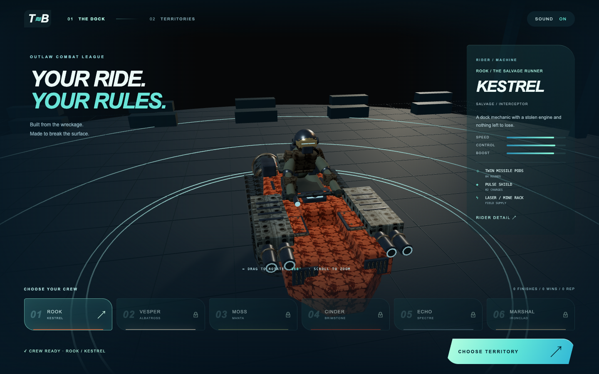

# Tidebreak — The Drowned Frontier

An original dystopian hydro-speeder combat racer built with Three.js, the 404 game recipe asset pipeline and Atlas MCP art production. Six exposed rider–machine pairs compete across six complete territories: flooded stadium, mangrove swamp, wet gorge, volcanic caldera, decaying spillway and Atlantic wreck field.

**New contributor?** See [CONTRIBUTING.md](CONTRIBUTING.md) for cloning, the pinned 404 tool setup, the code map and the branch/pull-request workflow. The game runs without an Atlas key or a build step. Production rules are in [AGENTS.md](AGENTS.md).



## Play locally

```sh
python3 -m http.server 4173 --bind 127.0.0.1 --directory game
```

Open http://localhost:4173/. No build step, runtime services or API keys. Serve the self-contained `game/` directory to deploy.

- Auto acceleration; A/D or arrows steer, hold S/down to brake then reverse (release to accelerate forward), Space boosts. Everyone launches with 15 seconds of labeled turbo assistance. After that, a full boost reserve lasts ten seconds and recharges in ten seconds; partial reserves work. Release an exhausted boost trigger to rearm.
- Solid piers and barriers stop the hull; ramps support slow travel and launch from their raised lip.
- F fires missiles, Q deploys the held special, E activates a visible pulse shield. Everyone starts with four missiles and two shield charges, with no shield automatically active. Three damaging hits eliminate a racer.
- R recovers to the racing line; Escape pauses. Phone controls include steering, turbo, brake/reverse, fire, special and shield.
- Title and loading screen → **Enter the dock** → select a rider and machine → **Choose territory** → select an arena → 3–2–1 countdown → race.
- Optional **Quick Race** on the title starts Rook / Kestrel in the same full Meridian combat race, including countdown and earned progression.
- Dock: drag to rotate the actual 3D spacecraft, scroll to zoom, or inspect the rider closely. All six crews can be inspected; only Rook / Kestrel starts unlocked.
- Six independent 8.4–9.8 km circuits. Each keeps its own environment from start to finish. Only Meridian starts open; locked arenas show their artwork, route and unlock requirement. Shared supply rows, crossings, marked channels, barriers and ramps create racing decisions.
- Turquoise Nitro supplies trigger five seconds of automatic boost with a visible countdown, ignition sound and exhaust effects, without spending the regular boost reserve.
- Rivals spend ammunition and energy, fight each other, collect finite supplies and make mistakes. Visible drafting and pursuit power help keep the field catchable.
- Live rival labels, gaps, hull damage, incoming warnings and a six-crew result classification. Remaining racers continue while results are displayed.
- Finishing milestones and reputation unlock crews. Eliminated runs earn participation reputation. Earlier career totals and earned crews migrate; the six new territory records start fresh because the old contracts were different courses. Practice earns best times only.
- Atlas materials, original procedural spacecraft, scene reflections, foam wakes, colored exhaust and refractive lens water.

The local collision, supply, audio, fleet-finish and interface changes are documented in [the refit notes](docs/REFIT.md).

The detailed weapon rules, rewards and primary-source research are in [the combat design](docs/COMBAT.md).

## Production and checks

The canonical recipe helpers remain unchanged. Shipping models use original Three.js constructor geometry; Atlas supplies references and texture maps. Material and lighting choices are reviewed in the moving build. There are no imported meshes.

With dependencies installed in adjacent `../404-game-recipe`:

```sh
node --test tests/*.test.mjs
node ../404-game-recipe/harness/verify.mjs game/assets --size=560
node ../404-game-recipe/harness/ship.mjs game
node tools/territory-flow-check.mjs
node tools/combat-touch-check.mjs
node tools/combat-endurance-check.mjs
node tools/territory-races-check.mjs
node tools/compliance-check.mjs --selftest
node ../404-game-recipe/harness/jam.mjs http://localhost:4173/ --start=#quickraceb --out=evidence/compliance/stock-local
```

Browser checks run sequentially and require the local server. The combat driver uses actual keyboard events from a fresh save and checks earned progression. The six-territory driver uses an explicitly unlocked test fixture and real keyboard driving through each whole course; it does not demonstrate earning those unlocks. Neither driver teleports or injects race progress. Older chapter and spacecraft evidence is historical.

The unmodified 404 jam harness now starts the full combat race through the visible Quick Race control, using its supported `--start` argument. The dock/territory setup path remains available and is checked separately with real inputs. The historical navigation adapter is no longer used for current gate evidence. Local passes are not live submission verdicts. See [compliance status](docs/COMPLIANCE.md) and [future production rules](AGENTS.md).

This remains a browser game with procedural geometry, not demonstrated commercial AAA photorealism. Water reflections use a limited-resolution planar render; scenery repeats modular assets; AI follows route coordinates rather than the player's full free-steering physics. Broad physical-phone testing and a deployed competition gate are still needed. The final release is authorized; the Pages workflow publishes only `game/` after validation. Deployment, live gate and entry status are tracked in [the release audit](docs/RELEASE-AUDIT.md).

See [production scope](docs/DYSTOPIA.md), [campaign](docs/CAMPAIGN.md), [style](docs/STYLE.md), [provenance](docs/CREDITS.md) and [current validation](docs/COMPLIANCE-VALIDATION.md).

Final release: earned territory and craft unlocks are restored (`PREVIEW_UNLOCKS=false`). Earlier preview results remain separate from career progress. `npm run check:release` rejects an enabled preview switch.
